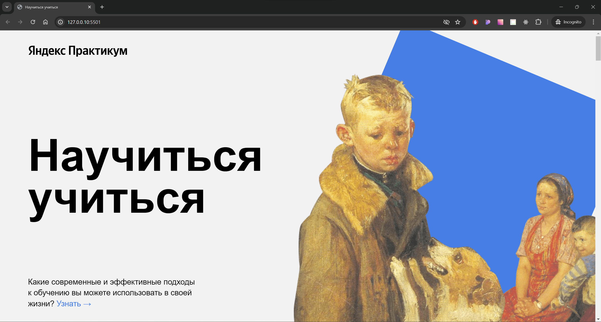

# Одностраничный сайт - "Научиться учиться"
Научиться учиться – это одностраничный сайт, созданный в рамках прохождения курса web-разработчик от [Yandex.Praktikum](https://practicum.yandex.ru/). Основная идея данного сайта заключается в том, чтобы рассказать, как эффективно обучаться тому или иному навыку. При разработке данного сайта, обучающиеся осваивают основные принципы верески и параллельно перенимает методики эффективного обучения.

## О технологиях:

Сайт разработан с использованием языков HTML и CSS без использования скриптовых языков. Построение сетки реализовано с использованием Flex-box верстки, реализована методология БЭМ (nested).

## Как запустить:

- клонировать репозиторий к себе на компьютер
- открыть проект в VS Code и запустить Live Server
